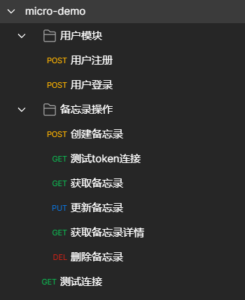

# micro-todoList
# Go-Micro V4 + RabbitMQ 构造简单备忘录

将原项目的micro的v2升到v4，服务发现使用etcd，支持熔断机制，token验证，网关和各模块之间的rpc通信等

# 项目的详细博客地址

**[用户模块](https://blog.csdn.net/weixin_45304503/article/details/122286980)**

**[备忘录模块](https://blog.csdn.net/weixin_45304503/article/details/122301707)**

# 项目的视频介绍地址

[Go-Micro+RabbitMQ 构建简单备忘录](https://www.bilibili.com/video/BV1h44y1L7LN)

# 项目的主要功能介绍

- 用户注册登录 ( jwt-go鉴权 )
- 新增/删除/修改/查询 备忘录

# 项目主要依赖：

**Golang V1.18**

- Gin
- Gorm
- mysql
- go-micro
- protobuf
- grpc
- amqp
- ini
- hystrix
- jwt-go
- crypto

# 项目结构
## 1.grpc_todolist 项目总体
```
grpc-todolist/
├── app                   // 各个微服务
│   ├── gateway           // 网关
│   ├── task              // 任务模块微服务
│   └── user              // 用户模块微服务
├── bin                   // 编译后的二进制文件模块
├── config                // 配置文件
├── consts                // 定义的常量
├── doc                   // 接口文档
├── idl                   // protoc文件
│   └── pb                // 放置生成的pb文件
├── logs                  // 放置打印日志模块
├── pkg                   // 各种包
│   ├── ctl               // 用户操作
│   ├── e                 // 统一错误状态码
│   ├── logger            // 日志
│   └── util              // 各种工具、JWT等等..
└── types                 // 定义各种结构体
```

## 2.gateway 网关部分
```
gateway/
├── cmd                   // 启动入口
├── http                  // HTTP请求头
├── handler               // 视图层
├── logs                  // 放置打印日志模块
├── middleware            // 中间件
├── router                // http 路由模块
├── rpc                   // rpc 调用
└── wrappers              // 熔断
```

## 3.user && task 用户与任务模块
```
task/
├── cmd                   // 启动入口
├── service               // 业务服务
├── repository            // 持久层
│    ├── db               // 视图层
│    │    ├── dao         // 对数据库进行操作
│    │    └── model       // 定义数据库的模型
│    └── mq               // 放置 mq
├── script                // 监听 mq 的脚本
└── service               // 服务
```


`config/config.ini`文件，直接将 `config.ini.example-->config.ini` 就可以了
conf/config.ini 文件
```ini
[service]
AppMode = debug
HttpPort = :4000

[mysql]
Db = mysql
DbHost = 127.0.0.1
DbPort = 3306
DbUser = root
DbPassWord = root
DbName = micro_todolist

[rabbitmq]
RabbitMQ = amqp
RabbitMQUser = guest
RabbitMQPassWord = guest
RabbitMQHost = localhost
RabbitMQPort = 5672
```


# 运行简要说明
1. 启动环境

```shell
make env-up
```

2. 在app文件夹下的cmd，执行main.go函数

```shell
go run main.go
```

**注意：**
1. 保证rabbitMQ开启状态
2. 保证etcd开启状态
3. 依次执行各模块下的main.go文件

**如果出错一定要注意打开etcd的keeper查看服务是否注册到etcd中！！**

# 导入接口文档

打开postman，点击导入


选择导入文件


效果




